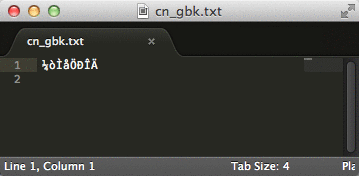

#配置自己的sublime简单介绍

####一、安装

  1、去sublime官网上下载最新的sublime text 3：  http://www.sublimetext.com/

  2、安装sublime text 3

####二、汉化

   1、打开汉化包，在**配置自己的sublime**文件夹下，或者下载 http://pan.baidu.com/s/1mi1XyHi

   2、打开sublime text 3，打开菜单->preferences->Browse Packages，进入到文件管理器：

   3、返回上一层到sublime text 3 文件夹，打开“Installed Packages”文件夹。粘贴汉化包文件“Default.sublime-package”到“Installed Packages”文件夹下面，无需刷新即可看到汉化效果。

####三、flatland主题
安装flatland主题

https://packagecontrol.io/packages/Theme%20-%20Flatland

####四、安装插件

Package Control

    CTRL+`

   出现控制台 粘贴以下代码至控制台,粘贴下面代码后回车

    import urllib.request,os; pf = 'Package Control.sublime-package'; ipp = sublime.installed_packages_path(); urllib.request.install_opener( urllib.request.build_opener( urllib.request.ProxyHandler()) ); open(os.path.join(ipp, pf), 'wb').write(urllib.request.urlopen( 'http://sublime.wbond.net/' + pf.replace(' ','%20')).read())

Emmet

功能：编码快捷键，前端必备

简介：Emmet作为zen coding的升级版，对于前端来说，可是必备插件，如果你对它还不太熟悉，可以在其官网（http://docs.emmet.io/）上看下具体的演示视频。

使用：教程-http://docs.emmet.io/cheat-sheet/、http://peters-playground.com/Emmet-Css-Snippets-for-Sublime-Text-2/

JSFormat

功能：Javascript的代码格式化插件

简介：很多网站的JS代码都进行了压缩，一行式的甚至混淆压缩，这让我们看起来很吃力。而这个插件能帮我们把原始代码进行格式的整理，包括换行和缩进等等，是代码一目了然，更快读懂~

使用：在已压缩的JS文件中，右键选择jsFormat或者使用默认快捷键（Ctrl+Alt+F）

Bracket Highlighter

功能：代码匹配

简介：可匹配[], (), {}, “”, ”, <tag></tag>，高亮标记，便于查看起始和结束标记

使用：点击对应代码即可

jQuery

功能：jQ函数提示

简介：快捷输入jQ函数，是偷懒的好方法

Doc​Blockr

功能：生成优美注释

简介：标准的注释，包括函数名、参数、返回值等，并以多行显示，手动写比较麻烦

使用：输入/*、/**然后回车，还有很多用法，请参照 https://sublime.wbond.net/packages/DocBlockr

ConvertToUTF8

功能：文件转码成utf-8

简介：通过本插件，您可以编辑并保存目前编码不被 Sublime Text 支持的文件，特别是中日韩用户使用的 GB2312，GBK，BIG5，EUC-KR，EUC-JP ，ANSI等。ConvertToUTF8 同时支持 Sublime Text 2 和 3。

使用：安装插件后自动转换为utf-8格式

AutoFileName

功能：快捷输入文件名

简介：自动完成文件名的输入，如图片选取

使用：输入/即可看到相对于本项目文件夹的其他文件

IMESupport

功能：sublime中文输入法

简介：还在纠结 Sublime Text 中文输入法不能跟随光标吗？试试「IMESupport 」这个插件吧！目前只支持 Windows，在搜索等界面不能很好的跟随光标。

使用：Ctrl + Shift + P → 输入pci → 输入IMESupport → 回车

CSS3

功能：支持css3高亮提示

scss

功能：支持scss高亮提示

cssFormat

功能：对css进行格式化、美化

git

功能：git管理

简介：插件基本上实现了git的所有功能

nodeJs

功能：nodeJs提示、高亮

markDown Editing

功能：支持Markdown语法高亮；支持Github Favored Markdown语法；自带3个主题。

OmniMarkupPreviwer

功能：时在浏览器中预，而MarkdownPreview是需要手动生成的和F5的。览如果双屏的话，应该具有不错的体验。快捷键如下：
Ctrl+Alt+O: Preview Markup in Browser.
Ctrl+Alt+X: Export Markup as HTML.
Ctrl+Alt+C: Copy Markup as HTML.

FileDiffs

功能：强大的比较代码不同工具

简介：比较当前文件与选中的代码、剪切板中代码、另一文件、未保存文件之间的差别。可配置为显示差别在外部比较工具，精确到行。

使用：右键标签页，出现FileDiffs Menu或者Diff with Tab…选择对应文件比较即可

持续更新中.......

参考资料：http://www.zhuowenli.com/diary/sublime-plugin.html

http://www.jianshu.com/p/aa30cc25c91b

http://www.xuanfengge.com/practical-collection-of-sublime-plug-in.html